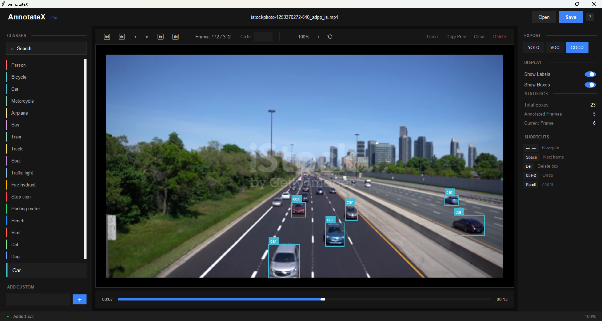

# Video_Labeling_Yolo

A powerful, user-friendly video labeling software for machine learning practitioners and researchers. Create high-quality training datasets for YOLO, Faster R-CNN, and other object detection models.

---

## 📥 Download Ready-to-Use Software

**Windows users:** Download and run directly - No installation or Python required!

👉 **[Download AnnotateX.exe](dist/AnnotateX.exe)** (Windows Executable)

---



## Features

- Load and navigate video files (MP4, AVI, MOV, MKV)
- Draw bounding boxes with click and drag
- 80+ pre-defined COCO classes + custom classes
- Export annotations in multiple formats:
  - YOLO
  - Pascal VOC
  - COCO JSON
- Frame-by-frame navigation
- Copy annotations from previous frame
- Zoom and pan support
- Keyboard shortcuts for efficient workflow

## Run from Source (Alternative)

```bash
pip install opencv-python pillow numpy
python video_annotating.py
```

## Requirements (for source only)

- Python 3.8+
- OpenCV
- Pillow
- NumPy
- Tkinter (included with Python)

## Keyboard Shortcuts

| Key | Action |
|-----|--------|
| ← → | Navigate frames |
| Space | Next frame |
| Delete | Delete selected box |
| Ctrl+Z | Undo |
| Ctrl+C | Copy from previous frame |
| Scroll | Zoom in/out |
| Escape | Deselect |
| Home/End | First/Last frame |

## Export Formats

- **YOLO**: Normalized coordinates `(class_id, x_center, y_center, width, height)`
- **Pascal VOC**: XML format for object detection
- **COCO**: JSON format with full annotations

## How to Use

1. Click **Open** to load a video file
2. Select a class from the left panel
3. Click and drag on the video to draw bounding boxes
4. Use arrow keys or timeline to navigate frames
5. Click **Save** to export annotations

## License

MIT License

## Author

[DaneshShokri94](https://github.com/DaneshShokri94)
